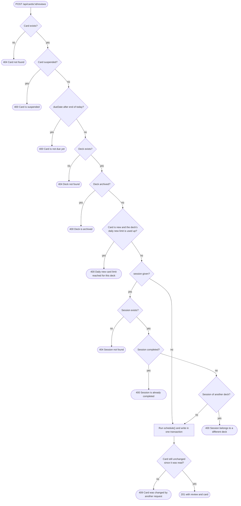

# Reviews

Answering a card is the most important write in the system. The endpoint checks a set of guards, runs the SM-2 function, and then updates the card and stores the review in one transaction. The review history is append-only: it can be read, but never edited or deleted. Endpoints 19 to 21 in the [index](/api/overview#endpoint-index) belong to this page.

## POST /api/cards/:id/reviews

Records one answer and schedules the card's next review.

| Body field | Type | Required | Rules |
|---|---|---|---|
| `rating` | `again`, `hard`, `good` or `easy` | Yes | See [Scheduling](/architecture/scheduling). |
| `timeSpentMs` | number | No | Zero or more milliseconds. |
| `session` | ObjectId | No | An active session of the card's own deck. |

```bash
curl -s -X POST http://localhost:5000/api/cards/6650a1f0c2e4b8d1a0000021/reviews \
  -H "Content-Type: application/json" \
  -d '{"rating":"good","timeSpentMs":4200,"session":"6650a1f0c2e4b8d1a0000031"}'
```

A successful call returns status `201` with the stored review and the card's new state:

```json
{
  "review": {
    "rating": "good",
    "previousStatus": "learning",
    "newStatus": "review",
    "previousInterval": 1,
    "newInterval": 6
  },
  "card": {
    "intervalDays": 6,
    "dueDate": "2026-10-14T00:00:00.000Z",
    "status": "review"
  }
}
```

### Guards

Before the card is scheduled, the endpoint checks the conditions in the order below. The first failure returns its own message, and nothing is written.



The new-card limit counts reviews made today (UTC) whose previous status was `new`, so a card that is relearning does not use up the allowance. The concurrency check matches the card on its `dueDate`, `status` and `suspended` as they were read, so two overlapping answers cannot both apply.

## GET /api/reviews

Lists reviews, newest first unless told otherwise.

| Query | Type | Default | Notes |
|---|---|---|---|
| `card` | ObjectId | any | Reviews of one card. |
| `deck` | ObjectId | any | Reviews made in one deck. |
| `session` | ObjectId | any | Reviews belonging to one session. |
| `rating` | `again`, `hard`, `good` or `easy` | any | Filter by rating. |
| `from`, `to` | date or datetime | none | `from` is inclusive at the start of its day, and `to` is inclusive at the end of its day. |
| `sort` | `reviewedAt` | `reviewedAt` | Only sort field. |
| `order` | `asc` or `desc` | `desc` | Direction. |
| `page`, `limit` | integers | `1`, `20` | Maximum `limit` 100. |

```bash
curl -s "http://localhost:5000/api/reviews?session=6650a1f0c2e4b8d1a0000031&order=asc"
```

A `from` later than `to` returns `400` with `from: must not be after to`.

## GET /api/reviews/:id

Returns one review with its fields: `card`, `deck`, `session` when present, `rating`, `previousStatus`, `newStatus`, `previousInterval`, `newInterval`, `easeFactorAfter`, `timeSpentMs` when given, and `reviewedAt`. Errors: `400 Invalid ID`, `404 Review not found`.

## No update or delete

There is no `PUT` or `DELETE` route for reviews, and a request to one returns `404` with `Route not found`. The reason is that a review feeds the daily new-card limit, the retention rate and the streaks. Editing one would change those numbers without reverting the card. Reviews leave the database only when their card or deck is deleted.
