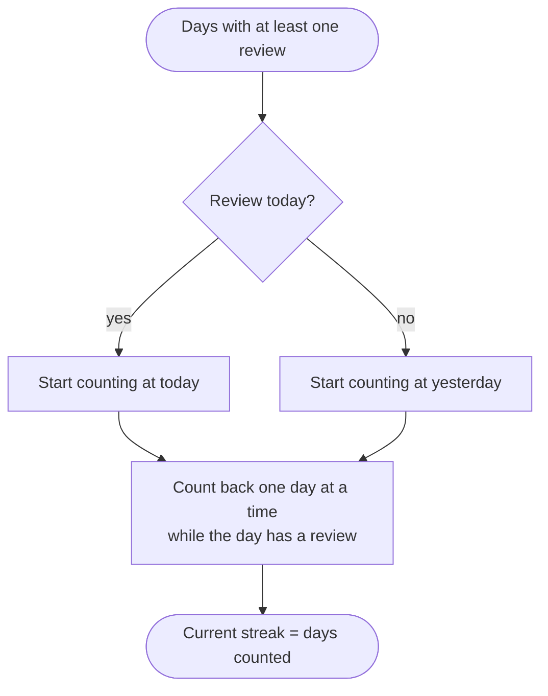

# Statistics

The statistics endpoints compute their numbers from the stored cards, reviews and sessions on each request. Nothing is cached, so the numbers always match the data. Endpoints 26 to 31 in the [index](/api/overview#endpoint-index) belong to this page.

## Definitions

These definitions apply to every statistic on this page.

**Retention** is the share of reviews that were passed. Only reviews of cards that were not `new` when reviewed count. A review passes when its rating is not `again`. The result is a percentage with one decimal, and it is zero when there are no such reviews.

**Mastery** is the share of cards that are `mastered`, out of all cards that are not suspended. A suspended card does not count in either part of the fraction.

**Average ease** is the mean ease factor of the cards that are no longer `new`, rounded to two decimals.

**Streak** counts consecutive UTC days with at least one review. The current streak counts back from today. If there is no review yet today, it starts from yesterday, so a streak only resets after a full day with no reviews. The longest streak is the longest such run in the whole history.



## GET /api/stats/overview

Returns a single object with no parameters.

```json
{
  "totalSubjects": 4,
  "totalDecks": 5,
  "totalCards": 59,
  "dueToday": 1,
  "reviewsToday": 6,
  "statusDistribution": { "new": 8, "learning": 5, "review": 31, "mastered": 15 },
  "retentionRate": 81.4,
  "averageEaseFactor": 2.41,
  "currentStreak": 9,
  "longestStreak": 9
}
```

`statusDistribution` counts every card, including suspended ones. `dueToday` is the size of the due bucket. `reviewsToday` counts reviews made today in UTC.

## GET /api/stats/decks/:id

Returns the statistics for one deck as an object: `cardCount`, `statusDistribution`, `masteryPercent`, `retentionRate`, `averageEaseFactor`, `dueToday`, `sessionCount` (completed sessions only) and `averageSessionAccuracy`. The session average is zero when the deck has no completed sessions.

| Status | Message |
|---|---|
| `400` | `Invalid ID` |
| `404` | `Deck not found` |

## GET /api/stats/subjects

Returns one row per subject as a bare array, sorted by mastery (highest first) and then by name. Each row has `_id`, `name`, `deckCount`, `cardCount`, `masteryPercent` and `retentionRate`. Archived decks count toward these totals, as they do in `deckCount`.

## GET /api/stats/activity

Returns one row per UTC day for the last `days` days, oldest first, including days with no reviews.

| Query | Type | Default | Limits |
|---|---|---|---|
| `days` | integer | `30` | 1 to 365 |

Each row has `date` (`YYYY-MM-DD`), `reviews` and `correct`, where `correct` counts reviews not rated `again`.

## GET /api/stats/hardest

Returns the cards with the most lapses as a bare array of card objects. Only cards with at least one lapse appear. The order is most lapses first, and then the lowest ease factor first.

| Query | Type | Default | Limits |
|---|---|---|---|
| `limit` | integer | `10` | 1 to 50 |

## GET /api/stats/forecast

Returns one row per UTC day from today, for `days` days, as a bare array of `{ date, count }`.

| Query | Type | Default | Limits |
|---|---|---|---|
| `days` | integer | `14` | 1 to 90 |

Day 0 (today) equals `dueToday`, and it includes overdue cards, because they are due now. Later days count the cards whose `dueDate` falls on that day, using the same exclusions as the due rule: no new, suspended or archived-deck cards.
