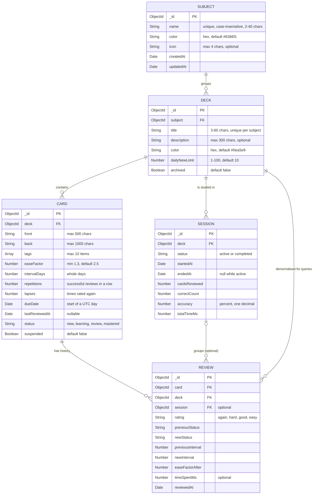

# Data model

The server stores its data in five Mongoose collections: `subjects`, `decks`, `cards`, `reviews` and `sessions`. A subject groups decks, a deck groups cards, and every answer to a card is kept as a review. A session groups the reviews made during one study run.

## Entity relationships

The `DECK` to `REVIEW` link is intentional duplication. A review copies its card's deck, so the daily new-card limit and the deck statistics can be counted from reviews without joining through cards.

## Collections in detail

### subjects

A subject has a `name` that must be unique regardless of case. The unique index uses a case-insensitive collation (`locale: 'en', strength: 2`), so "Math" and "math" collide. The `color` defaults to indigo and must be a six-digit hex value. `icon` is an optional emoji or short string, limited to four characters.

### decks

A deck belongs to exactly one subject. Its title is unique within that subject, again case-insensitively, through a compound index on `subject` and `title`. The same title may exist under two different subjects. `dailyNewLimit` caps how many new cards the study queue offers from this deck each day. `archived` removes the deck from study without deleting its history: archived decks never appear in the queue, the due lists or the forecast.

### cards

Each card stores its content and its scheduling state. The scheduling fields (`easeFactor`, `intervalDays`, `repetitions`, `lapses`, `dueDate`, `lastReviewedAt`, `status`) are written only by the review endpoint, never by the card create or update endpoints. A card's `dueDate` is always the start of a UTC day, so "due today" is a simple date comparison. The compound index on `deck`, `status` and `dueDate` serves the queue and the due filters. A second index on `tags` serves the tag filter.

### reviews

A review is an append-only record of one answer. It keeps the card's status and interval before and after the answer, so history can be read without replaying the algorithm. Reviews are never edited or deleted directly. They disappear only when their card or deck is deleted, because the delete endpoints remove them in the same transaction.

### sessions

A session is opened for one deck and finished by a `PATCH`. Finishing stores a summary (cards reviewed, correct count, accuracy and time) that is computed from the session's reviews at that moment. A deck can have several active sessions at once, because closing a browser tab leaves its session open. Only completed sessions count in the statistics.

## Cascade deletes

Deleting a parent removes its children inside one MongoDB transaction, so a failure leaves the data as it was.

| Delete | Removes in the same transaction |
|---|---|
| `DELETE /api/subjects/:id` | Nothing. It is refused with `400` while the subject still has decks. |
| `DELETE /api/decks/:id` | The deck's reviews, sessions and cards, then the deck. |
| `DELETE /api/cards/:id` | The card's reviews, then the card. |

Sessions are not removed when a card is deleted. A session belongs to a deck, not to a card, so it stays and keeps its summary.

## Validation layers

Each field passes two checks. Zod checks the shape of the request at the HTTP boundary, and Mongoose checks the stored document against the schema at the persistence boundary. Both produce a `400` with the same `{ "message": "..." }` format. The schema files in `src/models/` carry the rules that must hold regardless of which endpoint wrote the data, such as `min` and `max` values, enums and the unique indexes.
