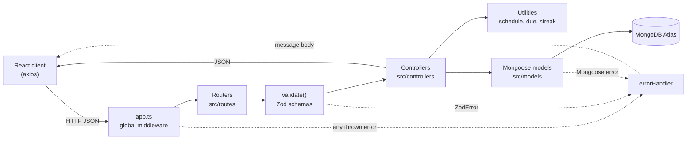
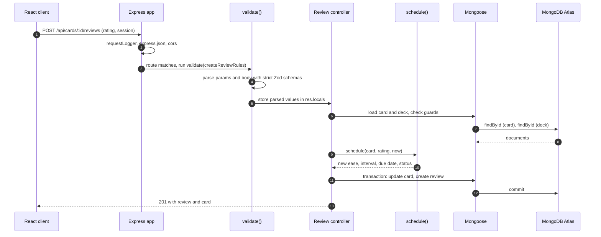
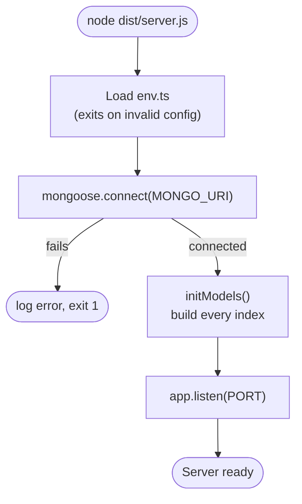

# Architecture overview

The server is a layered Express application. Each layer has one job, and a request passes through them in a fixed order. The layers are the routes, the validation middleware, the controllers, the Mongoose models and the utility modules that hold the business rules.

## Layers

The table below says what each folder contains and where to look when you change something.

| Folder or file | Contents | Typical change |
|---|---|---|
| `src/app.ts` | Global middleware and router mounting. Nothing else. | Add a new router or a global middleware. |
| `src/server.ts` | Connects to MongoDB, initialises indexes and starts listening. | Change startup behaviour. |
| `src/config/env.ts` | Typed environment configuration. | Add an environment variable. |
| `src/routes/` | One `express.Router()` per resource, each binding a path to a handler through `validate()`. | Add or rename an endpoint. |
| `src/controllers/` | Request handlers: business rules, reads and writes. | Change what an endpoint does. |
| `src/models/` | Mongoose schemas, indexes and the types inferred from them. | Add a field or an index. |
| `src/utils/` | Pure helpers: SM-2 scheduling, due rules, streaks, dates, pagination and transactions. | Change a rule shared by several endpoints. |
| `src/middleware/` | Request logger, `validate()`, 404 handler and error handler. | Change the error format or logging. |
| `src/types/` | Shared API response types and domain unions (ratings, statuses). | Change a response shape. |
| `src/scripts/` | The seed script and its pure planner. | Change the demo data. |

## Request lifecycle

Every request follows the same path. The example below is the most involved one, answering a card, which runs a transaction.

A few details in this sequence matter when you read the code. The validation step stores its results in `res.locals.validated`, and handlers read them through `getValidated()`. Express 5 makes `req.query` read-only, so parsed values are never written back onto `req`. The card update matches the card the guards just read, so a concurrent change makes the write match nothing, and the request fails with `409` instead of overwriting the other change.

## Startup sequence

The process loads configuration first, because an invalid configuration should stop it before any connection is opened.

Index building happens before the server starts listening. Duplicate-key behaviour, such as the unique subject name, depends on those indexes existing, so the server must not accept requests before they are built.

## Design rules

These rules keep the layers honest, and the tests check some of them.

Controllers never read `process.env`. The only environment access lives in `env.ts`. Routes contain no logic beyond validation and binding. `app.ts` contains configuration and mounting only. The scheduling function is pure: it takes the card, the rating and the current time as arguments and touches no database. Errors are thrown, never sent by hand, so the error handler is the single place that decides the status code and the message format.
