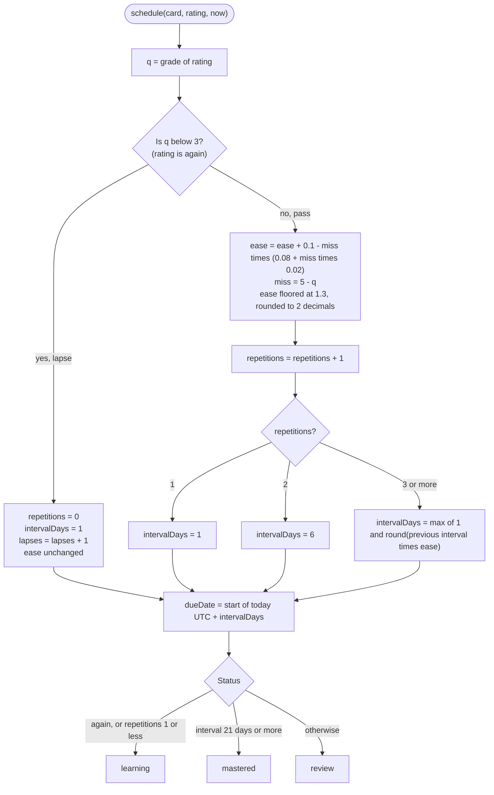
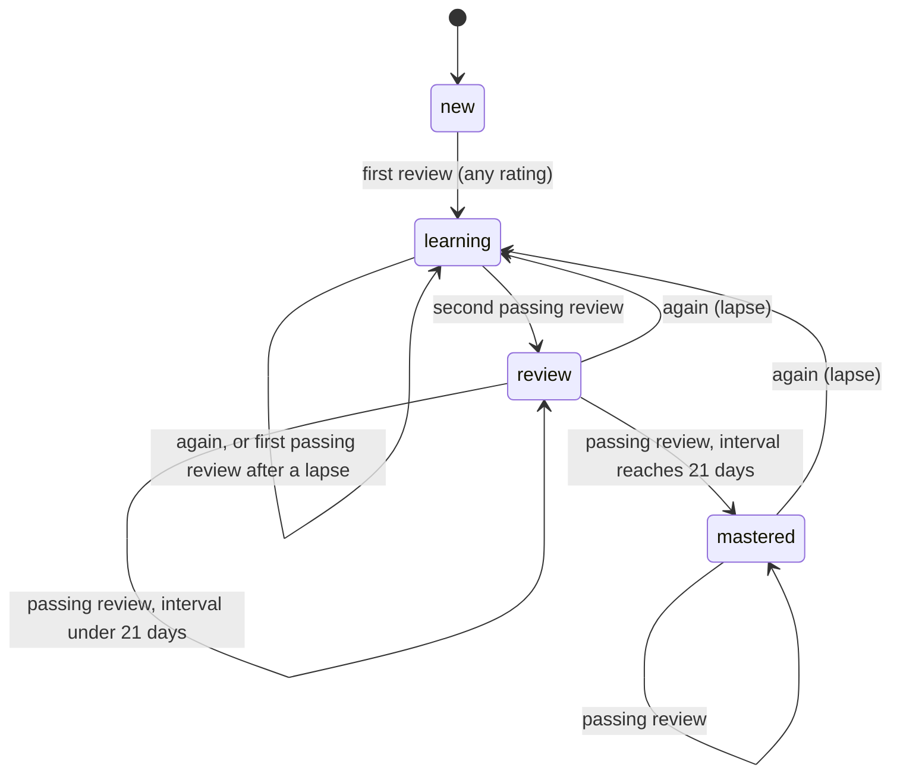

# Scheduling (SM-2)

Study Orbit schedules reviews with an in-house implementation of the SM-2 algorithm, the same family of method that older flashcard programs used. The whole algorithm lives in one pure function, `schedule(card, rating, now)`, in `src/utils/schedule.ts`. It reads a card's scheduling fields, returns the new ones, and touches no database. Because the date is passed in, the function is easy to test, and the seed script can replay it in simulated time.

## The rating scale

The API accepts four ratings. Each maps to an SM-2 quality grade.

| Rating | SM-2 grade `q` | Meaning | Counts as correct in statistics |
|---|---|---|---|
| `again` | 1 | The answer was wrong or forgotten. | No |
| `hard` | 3 | Correct, with great difficulty. | Yes |
| `good` | 4 | Correct, after some thought. | Yes |
| `easy` | 5 | Correct and immediate. | Yes |

Any grade below 3 counts as a failure. The lapse branch below is taken for `again` only, because `hard` is grade 3.

## What the function does

The flowchart shows every branch of `schedule()`.

Two details of this flowchart are easy to miss. The ease factor changes only for passing ratings, so a lapse keeps the old ease and resets the interval. The new `dueDate` is measured from the start of today in UTC, not from the moment of the review, which is why a card rated `again` becomes due tomorrow.

### Ease factor

The ease factor is the multiplier that grows the interval, and it starts at 2.5. For a passing grade, the change is `0.1 - miss times (0.08 + miss times 0.02)` where `miss = 5 - q`. That gives +0.10 for `easy`, zero for `good` and -0.14 for `hard`. The ease never falls below 1.3, and it is rounded to two decimals after every update, so stored values look like `2.36` rather than `2.3600000000000003`.

### Interval

The first successful review sets the interval to 1 day and the second to 6 days. From the third on, the interval is the previous interval multiplied by the ease, rounded, with a minimum of one day. A lapse resets the interval to 1 day and the repetition count to zero.

### Status

The status is derived from the result, never set directly. It is `learning` after a lapse or after the first successful review (`repetitions` of 1 or less). From the second successful review on it is `review`, and `mastered` once the interval reaches 21 days. The next section shows how a card moves between them.

## Status transitions

A card never returns to `new`. Once it has been reviewed, it stays in one of the three reviewed statuses. A mastered card can only leave that status through a lapse, because a passing review of a card with a 21-day interval always produces an interval of 27 days or more.

## Worked example

Take a card in the `review` status with an ease of 2.5, 2 repetitions and an interval of 6 days. The table follows two consecutive `good` reviews made on different days.

| Step | Rating | Repetitions | Interval (days) | Ease | Status | Due date |
|---|---|---|---|---|---|---|
| Before | none | 2 | 6 | 2.50 | review | today |
| 1 | `good` | 3 | round(6 × 2.5) = 15 | 2.50 | review | today + 15 days |
| 2 | `good` | 4 | round(15 × 2.5) = 38 | 2.50 | mastered | today + 38 days |
| 3 | `again` | 0 | 1 | 2.50 | learning | tomorrow |

Step 3 shows the cost of a lapse. The ease is kept, but the interval starts again from one day, so the card must earn its way back to mastery.

## Why whole days

SM-2 works in whole days, and this implementation keeps that. The consequence is a deliberate limitation, documented in [Known limitations](/reference/limitations). A card rated `again` cannot be shown again the same day through the API. A client that wants to repeat it within a session must requeue the card on its own side. Adding learning steps in minutes would mean a second scheduler, which the design left out of scope.

## Where the rules are tested

The unit tests for the function live in `src/utils/schedule.test.ts` and call `schedule` directly, without a database. The seed script depends on the same function, so the demo history is consistent with these rules by construction.
