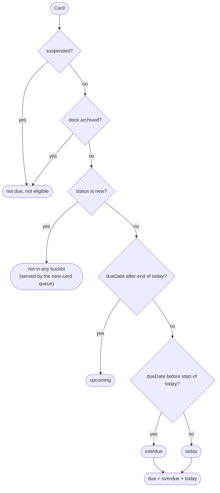
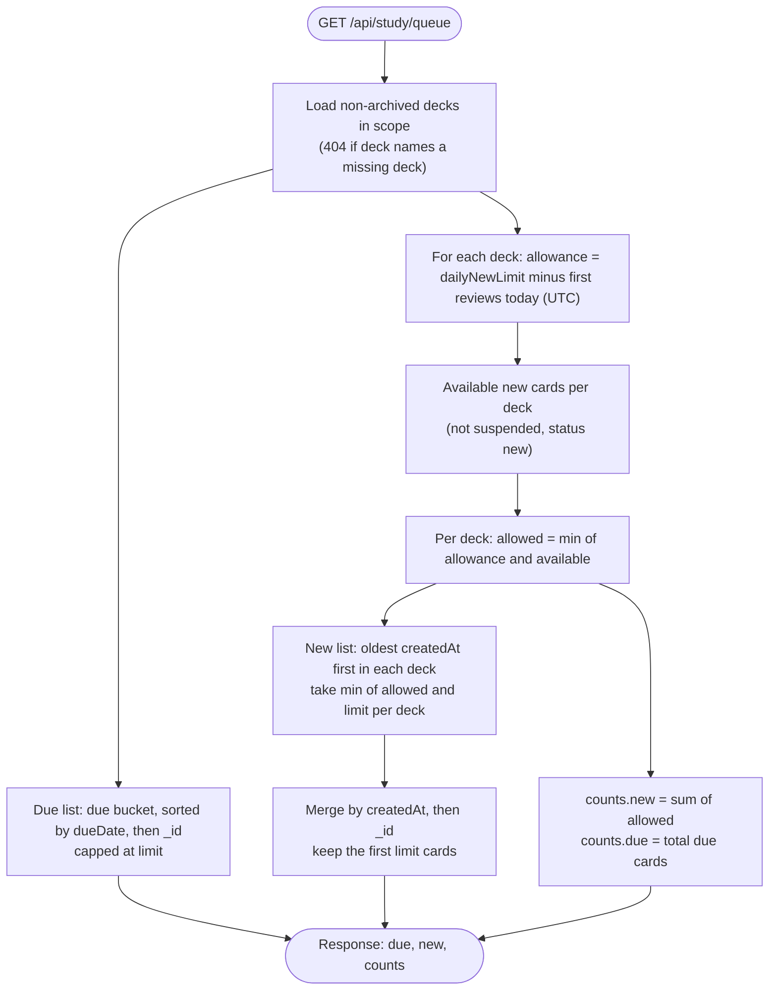

# Due rule and study queue

Several endpoints need to agree on which cards are due. The card filters, the deck `dueCount`, the study queue, the statistics and the forecast all call one shared helper, `src/utils/due.ts`. Because they share one definition, the numbers on different screens never disagree.

## The definition of due

A card is **eligible** when it is not suspended and its deck is not archived. An eligible card is **due** when its status is not `new` and its `dueDate` falls on or before the end of the current UTC day. The other buckets split the due cards by date.

The buckets have exact boundaries, all in UTC.

| Bucket | Condition on `dueDate` | Used by |
|---|---|---|
| `overdue` | before the start of today | `GET /api/cards?due=overdue`, and the `overdueDays` value on each card response |
| `today` | within today | `GET /api/cards?due=today` |
| `due` | on or before the end of today (`overdue` plus `today`) | the deck `dueCount`, the study queue, `dueToday` in the statistics and day 0 of the forecast |
| `upcoming` | after the end of today | `GET /api/cards?due=upcoming` |

`overdueDays` on a card response counts the whole calendar days between its due day and today. It is zero for a card that is not overdue, and always zero for new, suspended and archived-deck cards.

## The study queue

`GET /api/study/queue` returns two lists. The `due` list holds cards from the due bucket, most overdue first. The `new` list holds cards that have never been reviewed, limited per deck by that deck's remaining allowance for today. Both lists are capped by `limit`, and `counts` reports the uncapped totals.

The allowance is the deck's `dailyNewLimit` minus the number of cards in that deck whose first review happened today. Only reviews whose previous status was `new` count, so relearning a card does not use up the allowance.

Two edge cases shape the behaviour. A deck that is archived contributes nothing to either list, because the query skips it entirely. A deck whose allowance is spent contributes nothing to the new list, even if it has many new cards left, which is the purpose of the limit.

## Limits and counts

The two lists are capped separately, so a response can hold up to `2 × limit` cards. The `counts` object is the one to use for badges and totals. Its `new` value is the sum of what each deck would allow today, which can be larger than the `new` list when `limit` is small.

## Relation to the other statistics

The stats endpoints reuse these buckets rather than defining their own. `dueToday` on the overview and the deck statistics is the `due` bucket count. The forecast starts at the same number on day 0 and counts upcoming cards for the following days. Because archived decks and suspended cards are excluded everywhere, a suspended card never appears in a due count and never in the forecast.
