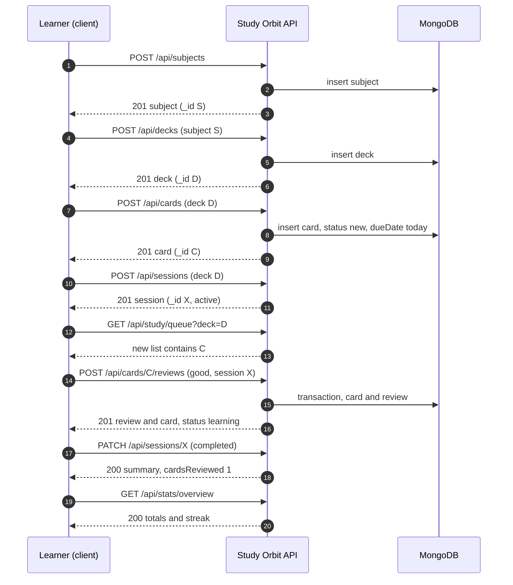

# Review walkthrough

This guide follows one realistic study session from start to finish. It creates a subject, a deck and a card, starts a session, answers the card, finishes the session and then reads the statistics. Every request uses the API exactly as documented, so you can run the commands in order against a development database and see each rule at work.

## The flow



## Step by step

Create the subject. Replace the placeholder IDs in later steps with the `_id` values the server returns.

```bash
curl -s -X POST http://localhost:5000/api/subjects \
  -H "Content-Type: application/json" \
  -d '{"name":"Biology","color":"#22c55e","icon":"🧬"}'
```

Create a deck in that subject. The title must be unique within the subject.

```bash
curl -s -X POST http://localhost:5000/api/decks \
  -H "Content-Type: application/json" \
  -d '{"title":"Cell structure","subject":"<SUBJECT_ID>","dailyNewLimit":10}'
```

Create a card. A new card is due at once, because its `dueDate` is the start of today.

```bash
curl -s -X POST http://localhost:5000/api/cards \
  -H "Content-Type: application/json" \
  -d '{"deck":"<DECK_ID>","front":"What is the powerhouse of the cell?","back":"The mitochondrion","tags":["organelles"]}'
```

Start a session, which groups the reviews of this run.

```bash
curl -s -X POST http://localhost:5000/api/sessions \
  -H "Content-Type: application/json" \
  -d '{"deck":"<DECK_ID>"}'
```

Ask the queue what to study. The new card appears in the `new` list because the deck's allowance for today is not used up.

```bash
curl -s "http://localhost:5000/api/study/queue?deck=<DECK_ID>"
```

Answer the card. Because the card is new, the review counts toward the deck's daily new-card limit. The response shows the state change: the status moves from `new` to `learning`, and the next due date is set by the scheduler.

```bash
curl -s -X POST http://localhost:5000/api/cards/<CARD_ID>/reviews \
  -H "Content-Type: application/json" \
  -d '{"rating":"good","timeSpentMs":4200,"session":"<SESSION_ID>"}'
```

Answer the same card again right away and the request fails. The card is not due until tomorrow, so the guard returns `400` with `Card is not due yet`. This is the behaviour the [scheduling rules](/architecture/scheduling) predict, and it is the reason the client should show the next card rather than the same one.

Finish the session. The summary is computed from the reviews made in it.

```bash
curl -s -X PATCH http://localhost:5000/api/sessions/<SESSION_ID> \
  -H "Content-Type: application/json" \
  -d '{"status":"completed"}'
```

Read the overview. Today's review appears in `reviewsToday`, and the streak includes today.

```bash
curl -s http://localhost:5000/api/stats/overview
```

## What to notice

Each step changes state through a single rule, and every later read agrees with the earlier write. The card's due date is computed in the review, the queue reads it, the forecast counts it and the overview totals it, all from the same stored fields. That agreement is the point of the design.

If you want to see the error paths as well, try an unknown field such as `"easeFactor": 3` on the card body, a duplicate deck title in the same subject, or an invalid ID in the path. Each returns a `400` with a message that names the problem. The [errors reference](/reference/errors) lists them all.
