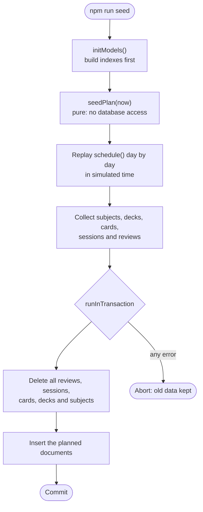

# Seeding the demo data

`npm run seed` fills the database with a realistic study history, so the statistics, the study queue and the forecast all have something to show. It is useful for demos and for development. It is also destructive, so read the safety rules before you run it.

## Safety first

The seed deletes every subject, deck, card, session and review in the database at `MONGO_URI`. It asks for no confirmation. Point it only at a development database. It runs in one transaction, so if anything fails the old data remains in place. Atlas clusters provide the replica set that transactions need.

## Pipeline

The seed is split into a pure planner and a thin writer. The planner decides every document in memory. The writer deletes the old data and inserts the new documents.



The planner is the part worth understanding. It does not write random history. It runs the real `schedule()` function for each simulated review, so the card state, the review history, the sessions and the statistics agree with each other and with the API's own rules. The random number generator has a fixed seed, so the structure is the same on every run. Only the timestamps depend on the current date.

## What it creates

| Item | Count | Notes |
|---|---|---|
| Subjects | 4 | Biology, Chemistry, Spanish and History. |
| Decks | 5 | One deck is archived, to show the archived behaviour. |
| Cards | 59 | Mixed statuses, including new and suspended cards. |
| Sessions | 24 | Each session reviews one deck. |
| Reviews | 195 | Produced by replaying the scheduler. |

The history covers 90 simulated days that end today. Study happens on the 9 days up to and including today, which gives a streak that ends today. Twelve more random study days are spread over the earlier weeks. The archived deck is studied on three past days, so its reviews exist but it is no longer offered.

Two rules keep the data useful for demonstrations. The last two cards of each active deck are never introduced, so some cards stay new and the new-card queue has something to offer. Each session is capped at 30 reviews, which rarely applies, because a deck has about a dozen cards.

The demo therefore contains cards due today, overdue cards, new cards, suspended cards and a deck whose daily limit is in use. Those are the cases the study queue and the due rule exist to handle.

## Running it

```bash
npm run seed
```

After it finishes, the endpoints in the [statistics reference](/api/stats) return non-empty results. A quick check is `curl -s http://localhost:5000/api/stats/overview`, which should show 59 cards and a current streak of 9.

Because the seed rebuilds the history from today's date, running it again on another day produces the same structure with different timestamps. That is by design, and it means the demo never looks out of date.
