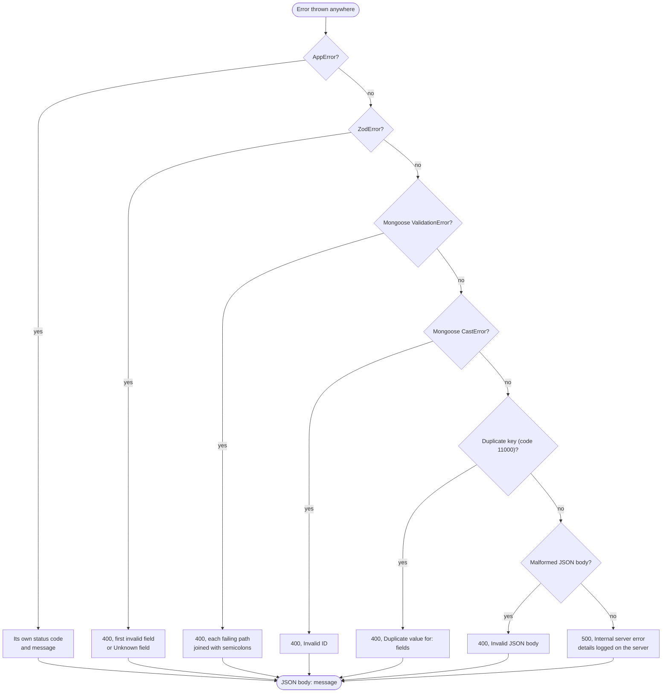

# Errors

Every failure in the server reaches one error handler, which converts it into a status code and a JSON body with a `message` field. Controllers throw errors and never build error responses themselves, so the format stays the same across all endpoints.

## How an error is mapped

The handler also has a rule for responses that have already started. If headers were sent, it passes the error on, because a second response would be invalid.

Unmatched routes never reach the error handler. The catch-all middleware registered after all routers returns `404` with `Route not found`.

## Status codes

| Status | Source | Example message |
|---|---|---|
| `400` | Zod, business rule, Mongoose validation, cast, duplicate key or JSON parsing | `name: Too small: expected string to have >=2 characters` |
| `404` | Missing resource, or no route matches | `Subject not found`, `Route not found` |
| `409` | Concurrent change during a review | `Card was changed by another request, please try again` |
| `500` | Any unexpected error | `Internal server error` |

## Validation messages

Zod errors name the first problem. The field is written as its path, followed by Zod's reason. An unknown field in a strict body is reported as `Unknown field: <names>`, and a malformed ID as `Invalid ID`. Only the first issue is shown, so fix the reported field and send the request again to see the next one.

Mongoose errors are checked after Zod, so they usually catch rules that the request schema does not express, such as the unique constraints of the database. A duplicate name is reported as `Duplicate value for: name`, using the fields of the unique index that failed.

## Business rule messages

These are the messages a client is most likely to show to a user. Each is an exact string in the code.

| Endpoint | Status | Message |
|---|---|---|
| `DELETE /api/subjects/:id` | `400` | `Cannot delete a subject that still has decks` |
| `POST /api/cards/:id/reviews` | `400` | `Card is suspended` |
| `POST /api/cards/:id/reviews` | `400` | `Card is not due yet` |
| `POST /api/cards/:id/reviews` | `400` | `Deck is archived` |
| `POST /api/cards/:id/reviews` | `400` | `Daily new card limit reached for this deck` |
| `POST /api/cards/:id/reviews` | `400` | `Session is already completed` |
| `POST /api/cards/:id/reviews` | `400` | `Session belongs to a different deck` |
| `POST /api/cards/:id/reviews` | `404` | `Session not found` |
| `POST /api/sessions` | `400` | `Deck is archived` |
| `PATCH /api/sessions/:id` | `400` | `Session is already completed` |
| `GET /api/reviews` | `400` | `from: must not be after to` |

A `404` from a review might mention the card, the deck or the session, and each has its own message: `Card not found`, `Deck not found` or `Session not found`.

## Logging

The logger writes one line per request when the response finishes, in the form `METHOD /path STATUS DURATIONms`. For a `500`, the error itself is written to the server console, and the response contains only the generic message, so internal details never reach the client.
